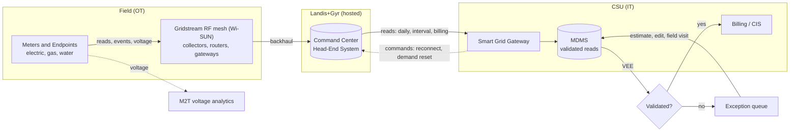
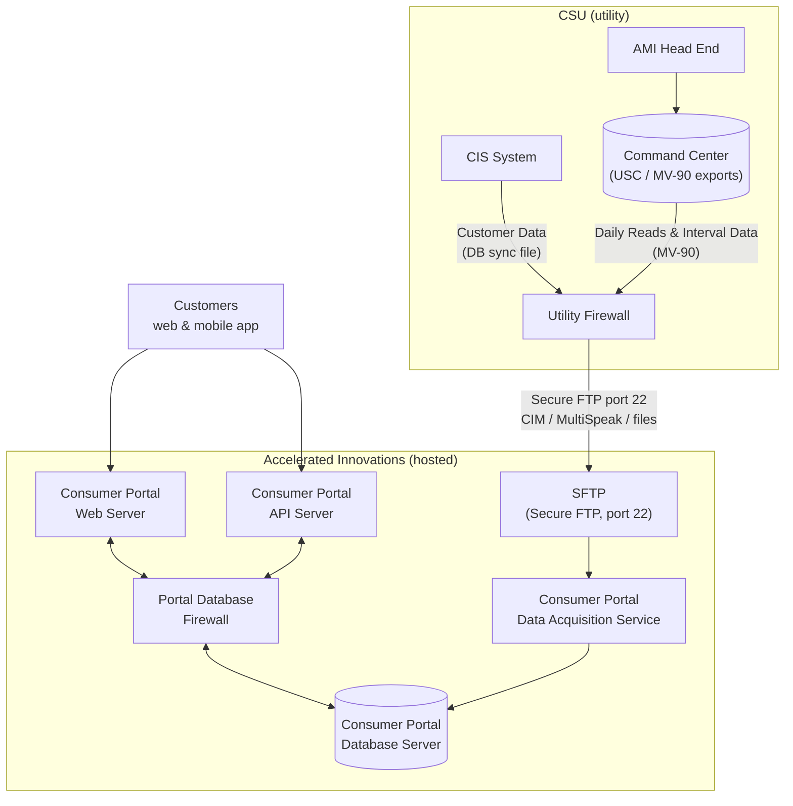
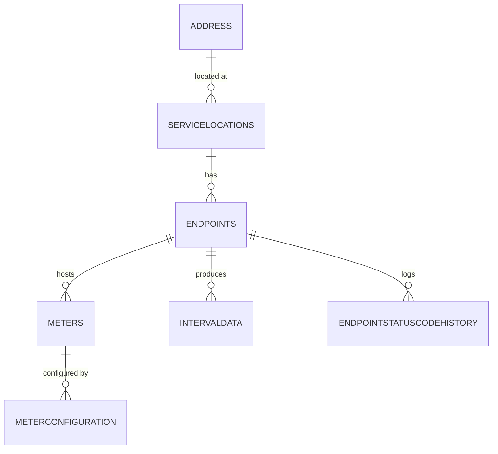
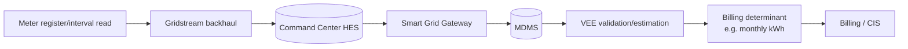

<span class="badge draft">Draft</span>

> Diagrams here are **text-based** (Mermaid) so they version-control cleanly and render
> automatically on the site. Edit the fenced ` ```mermaid ` blocks below.

## High-level data flow

Reflects the actual CSU / Landis+Gyr architecture (see
[OT/IT Landscape]({{ '/05-ot-it-landscape.html' | relative_url }})).



## Consumer Portal integration (Accelerated Innovations / SFTP)

How CSU customer and meter data reaches the customer-facing **Consumer Portal** (hosted by
Accelerated Innovations) over **Secure FTP (port 22)**, through firewalls on both sides.



**Data sources feeding the portal:**

| Source | Data | Format / tool |
|---|---|---|
| CIS System | Customer data (accounts, names, addresses) | DB sync file |
| AMI Head End → Command Center | Daily (scalar) reads | USC / MV-90 |
| AMI Head End → Command Center | Interval data | MV-90 |

> The vendor can support **either a customer-hosted SFTP or an AI-hosted SFTP** endpoint. The
> file-transfer cadence is documented in
> [Meter-Data Lifecycle]({{ '/04-meter-data-lifecycle.html' | relative_url }}).

## Domain entity relationships

_TODO: confirm against the catalog's `metadata/relationships.csv`._



## Lineage: a billing determinant

A worked example — interval consumption from meter to bill:



_TODO: pick one concrete field (e.g. `INTERVALDATA` kWh) and annotate the exact tables, the VEE
rules applied, and the destination, so lineage is concrete rather than abstract._

---

### Source references
- **CSU–Landis+Gyr Master Agreement** (2019) — system topology and data flow _(confidential)_.
- Catalog `metadata/relationships.csv` — authoritative table relationships.
- NREL, *AMI Data Management* (fy22osti/83877) — reference architecture patterns.
