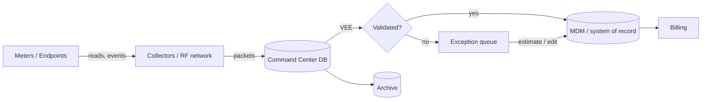
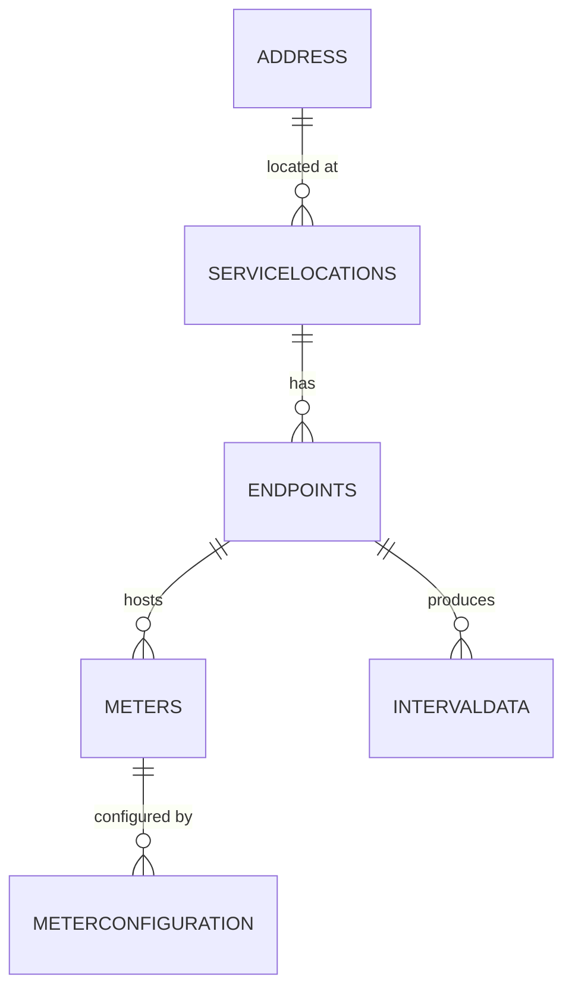

<span class="badge placeholder">Placeholder</span>

> Diagrams here are **text-based** (Mermaid) so they version-control cleanly and render
> automatically on the site. Edit the fenced ` ```mermaid ` blocks below.

## High-level data flow



## Domain entity relationships

_TODO: seed from the catalog's `metadata/relationships.csv`. Example skeleton:_



## Lineage: a billing determinant

_TODO: trace one critical field end-to-end (source table/column → transformations → VEE
rules applied → destination), so lineage is concrete rather than abstract._

---

### Source references
- Catalog `metadata/relationships.csv` — authoritative table relationships.
- NREL, *AMI Data Management* (fy22osti/83877) — reference architecture patterns.
