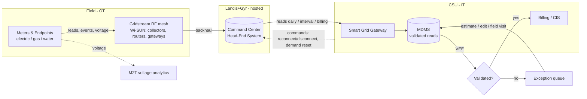
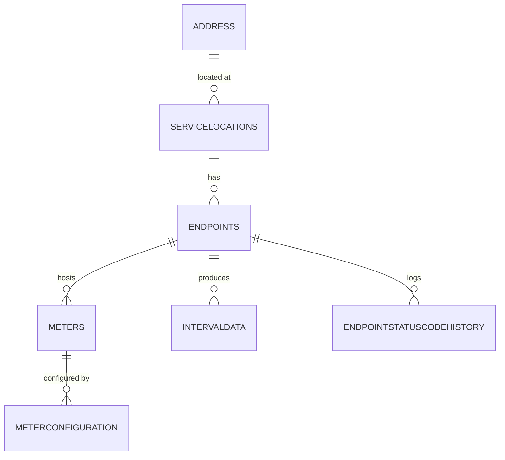
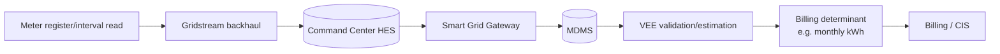

<span class="badge draft">Draft</span>

> Diagrams here are **text-based** (Mermaid) so they version-control cleanly and render
> automatically on the site. Edit the fenced ` ```mermaid ` blocks below.

## High-level data flow

Reflects the actual CSU / Landis+Gyr architecture (see
[OT/IT Landscape]({{ '/05-ot-it-landscape.html' | relative_url }})).



## Domain entity relationships

_TODO: confirm against the catalog's `metadata/relationships.csv`._



## Lineage: a billing determinant

A worked example — interval consumption from meter to bill:



_TODO: pick one concrete field (e.g. `INTERVALDATA` kWh) and annotate the exact tables, the VEE
rules applied, and the destination, so lineage is concrete rather than abstract._

---

### Source references
- **CSU–Landis+Gyr Master Agreement** (2019) — system topology and data flow _(confidential)_.
- Catalog `metadata/relationships.csv` — authoritative table relationships.
- NREL, *AMI Data Management* (fy22osti/83877) — reference architecture patterns.
