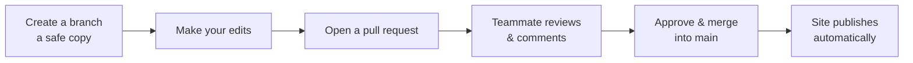

> You do **not** need to be a developer to contribute. Most edits take a couple of minutes
> in your web browser. This page goes from the easiest method to the most advanced.

## Before you start (one-time setup)

1. **Create a free [GitHub](https://github.com) account** if you don't have one.
2. **Ask to be added** to the `csu-advanced-utilities-tech` organization (your team lead can
   invite you). This gives you permission to edit.
3. That's it — no software to install for the browser method below.

> **Which thing am I editing?** The **Hub** (this site) is plain-text pages you edit directly.
> The **Catalog** is built from spreadsheets — see [Editing the Catalog](#editing-the-catalog-advanced)
> near the bottom. If you're not sure, you're probably editing the Hub.

---

## Method 1 — Edit in the browser (recommended)

Best for fixing text, filling in a section, or adding a table on the **Hub**.

1. Open the page you want to change on the live site, then find its file on GitHub. (Every
   Hub page is a file in the `data-governance` repository under `docs/`, e.g.
   `docs/01-executive-summary.md`.)
2. Click the **pencil icon** (✏️ *Edit this file*) in the top-right.
3. Make your changes in the text box. The format is **Markdown** — see [tips below](#markdown-in-30-seconds).
4. Scroll down to **Commit changes**. Write a short note of what you changed (e.g.
   "Filled in executive summary intro").
5. Choose one:
   - **Commit directly to `main`** — your change goes live in a minute or two. Fine for
     small, confident edits.
   - **Create a new branch and start a pull request** — your change is proposed for review
     first (see [Method 3](#method-3--propose-a-change-for-review-pull-request)). Best for
     bigger changes.
6. Done. GitHub rebuilds and publishes the site automatically.

---

## Method 2 — Suggest a change without editing

If you'd rather not edit files yourself, **open an Issue**:

1. Go to the repository on GitHub → **Issues** tab → **New issue**.
2. Describe what should change or be added, and which page.
3. Someone with edit access will pick it up.

This is a great low-pressure way for anyone to flag missing info or errors.

---

## Method 3 — Propose a change for review (pull request)

This is the standard "developer approach" and the safest way to make larger changes. The
idea: you make your edits on a **copy** (a *branch*), then ask for them to be **reviewed and
merged** into the live version.



- Nothing you do on a branch affects the live site until it's merged.
- Reviewers can leave comments and request tweaks before it goes live.
- You can do all of this **from the browser** (Method 1 creates a branch + pull request for
  you when you choose that option at the commit step).

---

## Editing the Catalog (advanced)

The **[Data Catalog](https://csu-advanced-utilities-tech.github.io/command-center-data-catalog/)**
works differently: its pages are **generated from spreadsheets**, so you don't edit the web
page — you edit the data and rebuild.

**The easy path (no coding):** fill in the Excel templates in the catalog repo's
`templates/` folder (table and column descriptions) and hand them to whoever runs the build.

**The developer path:**

1. Install [Git](https://git-scm.com) and [Python](https://www.python.org) once.
2. Clone the `command-center-data-catalog` repository to your computer.
3. Edit the CSV files in `metadata/` (table names, descriptions, grain, etc.).
4. Rebuild the site:
   ```bash
   python src/run_all.py
   ```
   *(On Windows, set `PYTHONUTF8=1` first so the script prints correctly.)*
5. Commit and push. GitHub Pages republishes the catalog automatically.

> **Golden rule for the catalog:** edit the **spreadsheets/CSVs**, never the generated
> `docs/*.html` files — the build overwrites those.

---

## Markdown in 30 seconds

Markdown is just text with a few simple symbols:

| You type | You get |
|---|---|
| `## Heading` | A section heading |
| `**bold**` | **bold** |
| `- item` | A bullet point |
| `[words](https://link)` | A clickable [link](https://example.com) |
| <code>&#124; A &#124; B &#124;</code> | A table column |

You can't really break anything permanently — every version is saved and reversible.

## A few good habits

- **One topic per change**, with a short, clear commit note.
- On Hub pages, update the **status badge** at the top as a section matures:
  `placeholder` → `draft` → `review` → `approved`.
- Replace `_TODO_` markers with real content as you go.
- When in doubt, use a **pull request** so a teammate can take a look first.

Still stuck? Check the [FAQ]({{ '/info/faq.html' | relative_url }}) or open an Issue.
