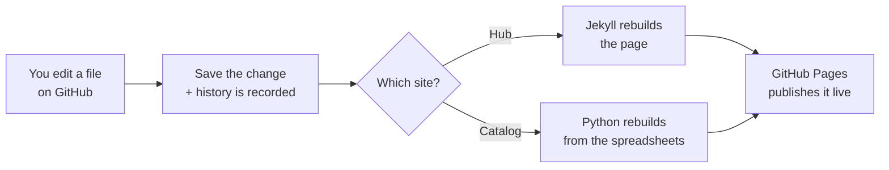

> **New here?** This page explains what we built and how it works in plain language.
> No technical background needed. For specific tasks, jump to
> [How to Contribute]({{ '/info/contributing.html' | relative_url }}),
> the [FAQ]({{ '/info/faq.html' | relative_url }}), or the
> [Glossary]({{ '/info/glossary.html' | relative_url }}).

## What this is

A central, always-current home for how we govern our Command Center meter data — who owns
what, how data flows and is checked, how we keep it secure, and how we measure success. It
lives online so the whole team can read it, trust it, and add to it over time.

## The two sites

We maintain **two connected websites** that look and feel like one product:

| Site | Answers the question | What's inside |
|---|---|---|
| **Data Governance Hub** (this site) | *How do we govern the data?* | 13 sections: scope, lifecycle, quality rules, security, roadmap, roles, KPIs, and more. |
| **[Data Catalog](https://csu-advanced-utilities-tech.github.io/command-center-data-catalog/)** | *What data do we actually have?* | A searchable dictionary of all 43 Command Center tables and 885 columns, grouped by domain. |

They cross-link to each other, so you can move between "the rules" and "the data" seamlessly.

## Where it's hosted & what it's built with

Everything is **free, web-based, and requires no software to view**.

- **Hosting:** [GitHub](https://github.com) — specifically our organization
  `csu-advanced-utilities-tech`. GitHub stores all the files and keeps a complete history of
  every change (who changed what, when, and why — and we can undo anything).
- **The public websites** are published by **GitHub Pages**, a free service that turns the
  files in GitHub into a live web page automatically.
- **The Hub** (this site) is written in **Markdown** — a simple text format anyone can learn
  in a few minutes. A tool called **Jekyll** turns that text into web pages automatically.
- **The Catalog** is **data-driven**: we maintain simple spreadsheets (CSV files) describing
  each table and column, and a small **Python** program turns those into the catalog website.
  We maintain the *data*, not the web page.

### How a change becomes a live page

The whole loop usually takes a minute or two after a change is approved.

## Why GitHub (and not a shared drive or wiki)

- **One source of truth** — no more "which version is current?"
- **Full history** — every edit is tracked and reversible; nothing is ever truly lost.
- **Safe to contribute** — changes can be reviewed before they go live, so mistakes are
  caught early and the live site stays clean.
- **Open to the whole team** — anyone we invite can read and propose changes from a browser.

## Learn more

  <a class="card" href="{{ '/info/contributing.html' | relative_url }}">
    <h3>How to Contribute →</h3>
    
Step-by-step ways to edit and add content — including the easy browser method.

  </a>
  <a class="card" href="{{ '/info/faq.html' | relative_url }}">
    <h3>FAQ →</h3>
    
Plain answers to common questions ("Can I break it?", "Do I need to install anything?").

  </a>
  <a class="card" href="{{ '/info/glossary.html' | relative_url }}">
    <h3>Glossary →</h3>
    
Tech terms (GitHub, repository, Markdown, pull request…) in plain English.

  </a>

